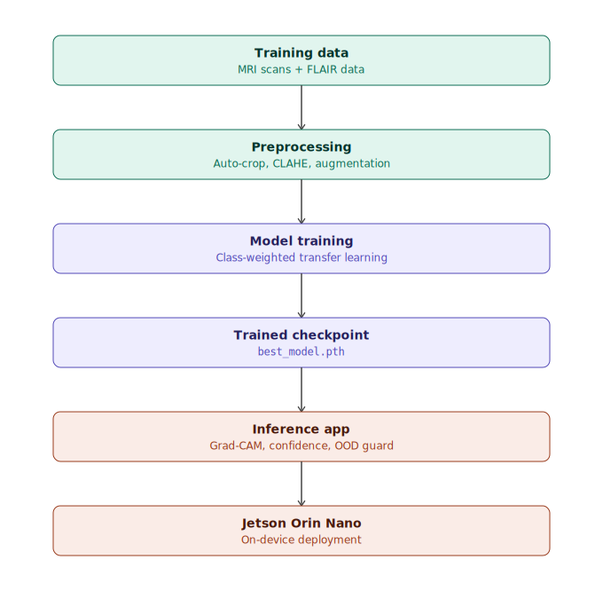
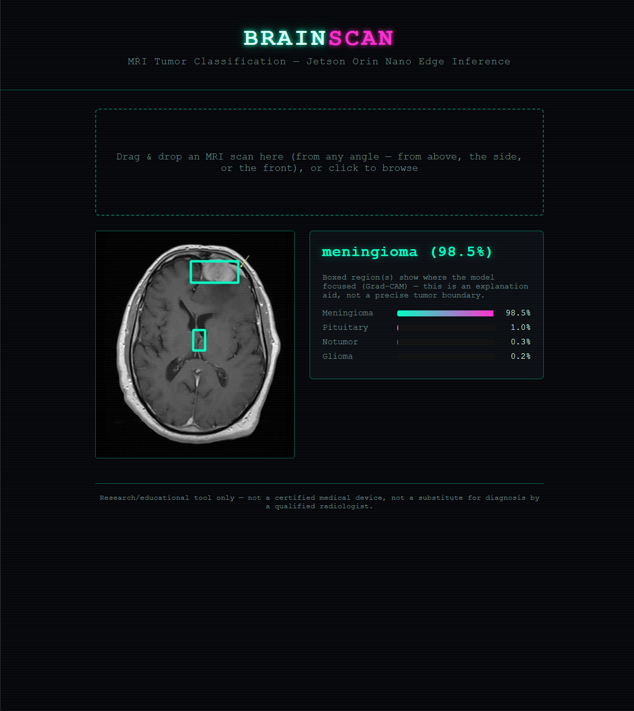

# BrainScan: Brain Tumor MRI Classifier

BrainScan looks at a brain MRI scan and predicts whether it shows a glioma, a meningioma, a pituitary tumor, or no tumor at all. It's built with PyTorch and runs entirely on an NVIDIA Jetson Orin Nano, a small computer that fits in your hand, so it works without sending anything to the cloud.

> This is a research and education project, not a certified medical device. Please never use it, or any hobby AI project, to make real medical decisions.



## Table of contents

- [Where things stand right now](#where-things-stand-right-now)
- [What's in this project](#whats-in-this-project)
- [How this is meant to be used](#how-this-is-meant-to-be-used)
- [1. Getting the training images](#1-getting-the-training-images)
- [2. Setting up the Jetson](#2-setting-up-the-jetson)
- [3. Training the model](#3-training-the-model)
- [4. Running the app](#4-running-the-app)
- [Which model to use](#which-model-to-use)
- [Making it more accurate](#making-it-more-accurate)
- [Getting the highlighted box in the right spot](#getting-the-highlighted-box-in-the-right-spot)
- [Making sure people upload real scans](#making-sure-people-upload-real-scans)
- [Teaching it a second type of scan](#teaching-it-a-second-type-of-scan)
- [Being honest about uncertainty](#being-honest-about-uncertainty)
- [Making sure it never crashes](#making-sure-it-never-crashes)
- [A fix that actually worked: pituitary scans](#a-fix-that-actually-worked-pituitary-scans)

## See it in action



## Where things stand right now

- On scans similar to what it was trained on, it gets the right answer about 96% of the time.
- I also tested it on a completely separate set of scans, from a different source, using a different scan type it had never seen during training. On those, it got the right answer about 90% of the time. That second number matters more than it might seem: it's checking whether the model actually learned something general, not just memorized the style of pictures it trained on.
- When the model isn't confident, the app says so plainly instead of just showing a number that looks trustworthy either way.
- I threw a lot of broken and unusual files at it on purpose (huge images, corrupted files, images with no color, images with a transparency layer) and it handles all of them without crashing.

## What's in this project

```
brain_tumor_classifier/
├── config.yaml              # every setting for training lives here
├── requirements.txt          # everything you need to install, except PyTorch itself
├── docs/
│   └── architecture.svg      # the diagram above
├── data/                     # your downloaded scans go here
├── models/                   # the trained model and result charts land here
├── scripts/
│   ├── download_dataset.py       # downloads the main set of scans
│   ├── download_lgg_dataset.py   # downloads a second, independent set of scans
│   ├── prepare_lgg_data.py       # sorts that second set into categories
│   └── setup_jetson.sh           # sets up everything needed on the Jetson
├── src/
│   ├── dataset.py            # loads and prepares images for training
│   ├── model.py               # defines which model design to use
│   ├── train.py               # the actual training process
│   ├── inference.py           # command line tool: give it one image, get one answer
│   ├── gradcam.py              # figures out which part of the image mattered most
│   ├── input_guard.py           # checks that an upload actually looks like an MRI scan
│   ├── evaluate_external.py     # tests the model against scans it never trained on
│   └── export_onnx.py         # optional: converts the model to a faster format
└── app/
    ├── server.py               # the web app: upload a scan, get an answer
    ├── templates/index.html
    └── static/style.css        # the look of the web page
```

## How this is meant to be used

The whole thing is meant to be built and run directly on the Jetson, using a Remote SSH connection from your laptop through VS Code.

1. Do everything on the Jetson itself, through that same terminal in VS Code.
2. Download the scans, train the model, then run the web app. All on the one device.
3. Training on the full combined set of images (around 15,000, once you add the second dataset described below) takes about 1 to 2 minutes per pass through the data, which is easily within what the Orin Nano can handle.

If you'd rather train somewhere with a stronger graphics card, like your own laptop or a free service like Google Colab, that's fine too. Just copy the finished model file over to the Jetson afterward and skip straight to running the app.

**You don't need a Jetson at all if you just want to try this out.** None of the actual code cares what kind of computer it's running on. Training, the app, all of it is just regular PyTorch and Flask. The Jetson matters if your goal is a small, offline device you can carry somewhere, since that's the whole point of choosing lightweight models here. But if you just want to run this on your own laptop or desktop, skip the Jetson setup script entirely and install PyTorch the normal way instead (a plain `pip install torch torchvision` works, with a CUDA version added if you have an NVIDIA graphics card).

---

## 1. Getting the training images

Kaggle (the site hosting the dataset) requires you to sign in to download things through code, so there's a small one time setup:

1. Go to kaggle.com/settings and click "Create New Token." This downloads a small file called kaggle.json.
2. Move that file to a folder called .kaggle in your home directory, and lock it down so only you can read it:
   ```bash
   mkdir -p ~/.kaggle
   mv ~/Downloads/kaggle.json ~/.kaggle/kaggle.json
   chmod 600 ~/.kaggle/kaggle.json
   ```
3. Run the download script:
   ```bash
   python scripts/download_dataset.py
   ```
   This should leave you with folders like this:
   ```
   data/Training/glioma/...
   data/Training/meningioma/...
   data/Training/notumor/...
   data/Training/pituitary/...
   data/Testing/glioma/...
   data/Testing/meningioma/...
   data/Testing/notumor/...
   data/Testing/pituitary/...
   ```
   If the folder names come out a little different, that's fine. The code figures out the categories automatically from whatever folder names it finds.

**If you'd rather not set up the download script,** you can just download the zip file straight from the Kaggle page in your browser and unzip it into the data folder yourself, matching the structure above.

---

## 2. Setting up the Jetson

One important thing to know up front: the normal way of installing PyTorch (`pip install torch`) quietly installs a version that can't use the Jetson's graphics chip at all. It'll still run, just much slower, using only the regular processor. You need a special version made for this exact hardware.

From your terminal, in the project folder:

```bash
chmod +x scripts/setup_jetson.sh
./scripts/setup_jetson.sh
```

This script:
- Creates a self-contained Python environment just for this project
- Installs the correct, graphics-enabled version of PyTorch for your Jetson
- Installs everything else this project needs
- Checks and tells you whether the graphics chip is actually being used

If the first attempt fails, it's usually because your exact version of the Jetson's operating system doesn't match what the script expected. The script will print a fallback link to NVIDIA's own download page where you can grab the exact right version by hand. It's worth checking NVIDIA's developer forums too, since the exact download links shift over time.

Every time you open a new terminal later, turn this environment back on with:
```bash
source .venv/bin/activate
```

---

## 3. Training the model

Once you have the images downloaded and the environment set up:

```bash
python src/train.py --config config.yaml
```

This will:
- Set aside a portion of the training images to check progress along the way, making sure each category is represented fairly in that portion
- Take a model that already knows how to recognize general shapes and images, and teach it specifically to recognize the four tumor categories
- Stop early if it stops improving, so it doesn't waste time
- Check its final performance against a set of images it has never seen before
- Save everything into the models folder: the trained model itself, a chart of how training went, and a chart showing exactly which categories it tends to mix up

You can change which underlying model design it uses, how long it trains, and other settings in config.yaml.

---

## 4. Running the app

**To test one single image from the command line:**
```bash
python src/inference.py --image path/to/scan.jpg --checkpoint models/best_model.pth
```
This prints how confident it is about each of the four possible answers.

**To use the actual web app (recommended):**
```bash
python app/server.py --checkpoint models/best_model.pth --port 5000
```
Then open the Jetson's address followed by :5000 in any web browser on the same network. Drop in an MRI image, and you'll get a prediction along with a confidence breakdown for each category. When it detects a tumor, it also draws a box over the part of the image that led it to that answer.

That box is meant to help you understand the model's reasoning, not to mark the exact edges of a tumor. Think of it as "here's roughly what caught its attention," not a precise outline.

If you upload something that clearly isn't a brain scan (a regular photo, a screenshot, and so on), the app catches this on its own and shows you a message along with a real example of what it's expecting instead of trying to force an answer.

---

## Which model to use

You can pick from four different underlying model designs in config.yaml:

- **MobileNetV3 Small** (the default): the fastest and lightest option, a good fit for a small device like the Orin Nano. Still gets solid results.
- **MobileNetV3 Large**: a bit bigger and a bit more accurate, still light enough for the Jetson.
- **ResNet18**: generally more accurate, but heavier and slower. Worth trying if you have time to spare for training and want to compare.
- **EfficientNet-B0**: tends to be the most accurate of the four in my testing, at the cost of being a bit bigger and slower than MobileNetV3 Small.

Switching between them is just one line in config.yaml, then retraining. Nothing else needs to change.

---

## Making it more accurate

A few things in this project push accuracy up without needing any new images:

- **Fair splitting for testing during training.** Instead of randomly setting aside images to check progress, the split makes sure each category shows up in the same proportion both in training and in that check. With only a few thousand images per category, a purely random split can accidentally end up short on one category by chance, which makes it harder to trust what the numbers are telling you.
- **Light, sensible variation during training.** Small crops, slight rotations, and small brightness changes, kept mild on purpose. MRI scans are always framed the same consistent way, so anything too aggressive would just create unrealistic training examples instead of useful variety.
- **A setting called label smoothing**, which stops the model from becoming overly sure of itself, which tends to help it generalize a little better to new images.
- **The EfficientNet-B0 option** mentioned above.
- **Checking each image twice at prediction time**, once normally and once flipped left to right, then averaging the two answers. This is free (no retraining needed) and gives a small, reliable boost in accuracy.

**A note on adding more training data.** It's tempting to think "just add more datasets," but worth knowing first: the main dataset this project uses is already a combination of three older public datasets. Most other "brain tumor MRI" datasets you'll find online are repackaged versions of those same three sources. Adding another one without checking could just add near duplicate images, which can make your test results look better than they really are without the model actually getting smarter. If you want real, independent images, look at bigger medical research archives like BraTS or TCIA (the Cancer Imaging Archive), though be aware these are usually a different file format, cover multiple types of scans at once, and are built for outlining tumors pixel by pixel rather than simple categorizing, so using them is a bigger undertaking than just adding a folder.

**A note on catching tumors early.** This dataset, like basically every public brain tumor dataset like it, only has labeled examples of tumors that are already big and obvious enough to have been diagnosed. There's no "early" or "subtle" label anywhere, because nobody labeled the data that way. Catching a tumor early is, in real medicine, one of the hardest and most important jobs there is. It usually needs several different types of scans, sometimes a contrast dye, and sometimes comparing scans taken months apart, and it's genuinely difficult even for trained specialists. A model trained on a single scan type with a few thousand images isn't a credible way to do that job, and I don't want to suggest otherwise. If early detection is something worth chasing later, it would really be a different project built around scans that outline the tumor precisely, with proper medical oversight, not just a bigger training folder.

---

## Getting the highlighted box in the right spot

If you've noticed the highlighted box sometimes landing somewhere that doesn't match the obvious problem area in an image, that's a real limitation worth explaining rather than brushing past.

**What was actually wrong at first:** how precisely that box can be placed depends entirely on which layer inside the model you're looking at. The first version of this project looked at the very last layer, which for every model design used here has been shrunk down so much that each square in its internal grid represents a fairly big 32 by 32 pixel block of the original image. That's just too blocky to draw a tight box around anything.

**The fix:** the code now automatically finds a layer partway through the model that still has a decent amount of detail left, instead of always using the very last one. This roughly doubles how precisely the box can be placed, and it works the same way across all four model designs without retraining anything, since it's purely about how the existing trained model gets explained afterward, not about changing the model itself.

**Being honest about what this does and doesn't fix:** a sharper box means a less blocky, more precise box. It does not guarantee the model is looking at the exact spot a person would circle. A model trained on a modest number of images can and sometimes does pick up on shortcuts, like the two sides of the brain looking slightly asymmetric, rather than truly focusing on the tumor itself. If the box still looks off sometimes, that's a genuine, honest signal about how the model actually makes its decisions, not something to explain away.

---

## Making sure people upload real scans

There's a quick check that runs before the model does anything, looking at two simple things about the image: whether it's basically black and white (real scans are, even when saved in a color file format, while ordinary photos usually have noticeable color), and whether the corners of the image are dark (scans in this dataset are cropped against a black background, so a bright, busy corner is a sign something is off). If either check fails, the app shows a message and a real example from the training images instead of trying to force an answer.

This is a simple, rule based check, not a trained model of its own. It'll reliably catch obviously wrong uploads like regular photos or screenshots, but it isn't perfect. It could occasionally be fooled by an unusual black and white image, or rarely flag a real scan that just looks a little different than expected. It doesn't need any extra training data to work.

---

## Teaching it a second type of scan

Real world testing kept turning up the same pattern: scans that clearly showed a glioma, but only when using a certain look and style, kept getting called "no tumor" with high confidence. The likely reason: the main dataset this project trains on uses one specific type of scan, one that involves a contrast dye and shows tumors as a bright, glowing shape. Gliomas in particular are diffuse and don't have clean edges, so in real practice, doctors often prefer a different scan type called FLAIR specifically because it's better at showing that kind of spread out change, especially around swelling. Meningiomas and pituitary tumors tend to form as a single obvious lump instead, so they still show up clearly in the scan type this project already knew. Put simply: the model had simply never seen this second scan style during training.

To close that gap, I added a second, completely independent set of images, sourced from a public glioma research collection, specifically using that FLAIR scan style. This only helps the glioma versus no tumor distinction, since that second set doesn't include any meningioma or pituitary examples. It's worth checking the download scripts for both sets if you want to see exactly where the images came from.

After retraining with this second dataset mixed in:

- A previously tricky case, one that used to score high confidence for the wrong answer, correctly flipped to the right one
- Testing against a held out portion of that second dataset (patients the model never trained on at all) went from about 87% right to about 90% right
- None of this cost anything on the original dataset. Accuracy there stayed about the same

Since mixing in a second dataset made one category much bigger than the other three, the training code also adjusts how much attention it pays to each category during training, so the smaller categories don't get overlooked.

---

## Being honest about uncertainty

Every prediction gets tagged as high, medium, or low confidence, based on both how confident the top answer is and how much it's beating the second place answer. When it's a low confidence result, the app shows a clear warning banner instead of displaying it exactly the same way as a clear cut answer.

This isn't based on some formal statistical study, it's a reasonable, cautious judgment call. The goal was never "the model is always right," since no model trained on this much data ever truly is. The goal was "when the model genuinely doesn't know, it says so," instead of quietly showing a wrong answer dressed up to look confident.

---

## Making sure it never crashes

The upload feature has been deliberately tested against a pile of awkward cases: huge images, images with a transparency layer, plain black and white images, corrupted files that aren't actually valid images at all, and someone submitting the form with no file attached. All of these are handled cleanly, either processed normally or met with a clear error message, never a crash.

---

## A fix that actually worked: pituitary scans

Real world testing also kept showing a specific pattern: scans clearly pointing at the pituitary gland kept getting called "no tumor." Interestingly, this wasn't a case of too little training data. Pituitary actually has the most training images of the three tumor categories, not the fewest. The more likely explanation was size. The pituitary gland is a small structure compared to the rest of the head, and a small tumor there can take up only a tiny part of even the original image. Gliomas and meningiomas tend to be large enough that shrinking the whole image down for the model doesn't lose much important detail. A small pituitary tumor might not survive that shrinking as well.

To test that idea directly, the size the images get shrunk to before feeding them into the model was increased from 224 pixels to 320 pixels, giving small details more room to survive. This held up:

- A previously tricky pituitary case that scored 95.8% confidence, with the highlighted box landing on a watermark instead of the actual tumor, improved to 98.6% confidence, with the box now landing directly on the tumor
- The FLAIR test result mentioned above also improved further, from 87% to 90%, so the change helped more broadly, not just with pituitary cases
- None of this cost anything on the regular test set either

This is a case where a specific guess about why something wasn't working got tested directly and confirmed with real before and after numbers, rather than just changing a setting and hoping.
